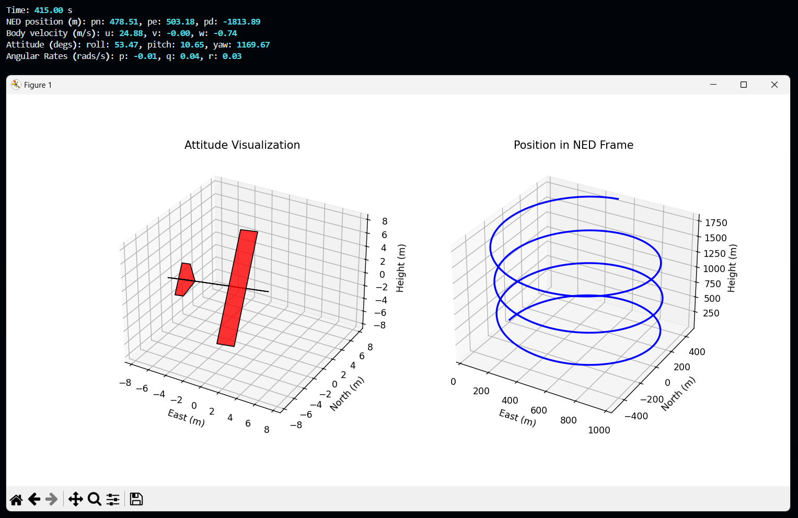
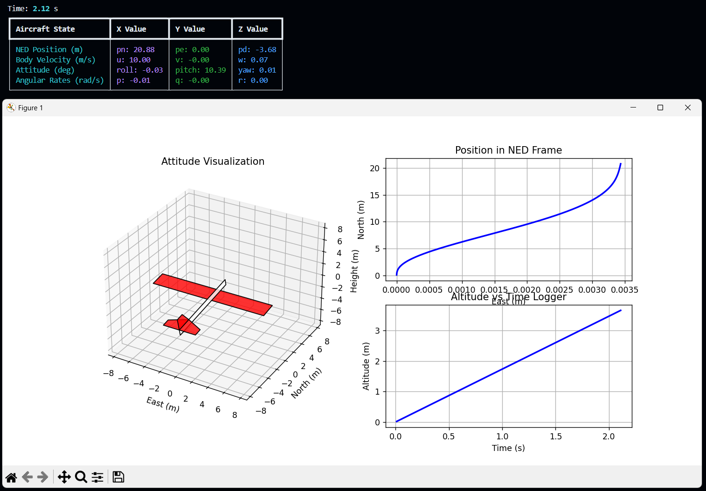

# Python UAV Simulator
A Python unmanned aircraft simulator based on the book *Small Unmanned Aircraft: Theory and Practice* by Randy Beard and Tim McLain.

For more information visit https://github.com/randybeard/mavsim_public

## Overview
The Python UAV Simulator provides a comprehensive environment for simulating the behavior of unmanned aerial vehicles (UAVs). It allows users to explore aircraft dynamics, sensor readings, autopilot behavior, and actuator responses in a controlled simulation framework.

The simulator is composed of four main modules, each with distinct responsibilities and submodules. These modules are organized into three levels: Physical, Electrical, and Software.

### Physical Level (Aircraft)
**Forces and Moments**:
Takes the current aircraft state and control deltas from the actuators.
Computes the forces (fx, fy, fz) and moments (l, m, n) acting on the aircraft.

**Kinematics and Dynamics**:
Uses the current state and forces and moments to compute the new state of the aircraft.

### Electrical Level
**Sensors**:
Simulates sensor readings and noise based on the true aircraft state.
Includes IMU (Inertial Measurement Unit), GPS, barometer, etc.

**Actuators**:
Takes autopilot control commands and computes the state of the actuators (servos and DC motors).
Outputs the control deltas for the aircraft simulator, closing the loop in the simulation.

### Software Level (Autopilot)
**Estimation Filters**:
Applies filters (e.g., Low Pass Filter, Kalman Filter) to sensor readings to estimate the aircraft state.

**Controllers**:
Uses the estimated state along with mission parameters or joystick/controller input to manage attitude control, path following (line or orbit), path managing, and path planning.

## Development

- [x] Main aicraft data handlers: `AircraftParameters`, `AircrafState` ...
- [x] Aircraft forces and moments (gravity, aerodynamic and propulsion) simulation
- [x] Aircraft kinematics and dynamics integration to calculate new state
- [ ] Multi functional visualization tool based on Matplotlib
- [ ] Trim calculation
- [ ] Wind and atmospheric model integration
- [ ] Realistic sensor data simulation including IMU, GPS, and barometer.
- [ ] Actuators simulation (servos and DC motor) with realistic transfer functions
- [ ] Estimation filters for airtcraft's state estimation
- [ ] Implement autopilot control layers: attitude control, path following ...
- [ ] Mission parametes support (waypoints)
- [ ] Real-time external joystick/controller support
- [ ] Unity 3D visualiztion framework 

## License

This project is licensed under the MIT - see the [LICENSE](LICENSE) file for details.
